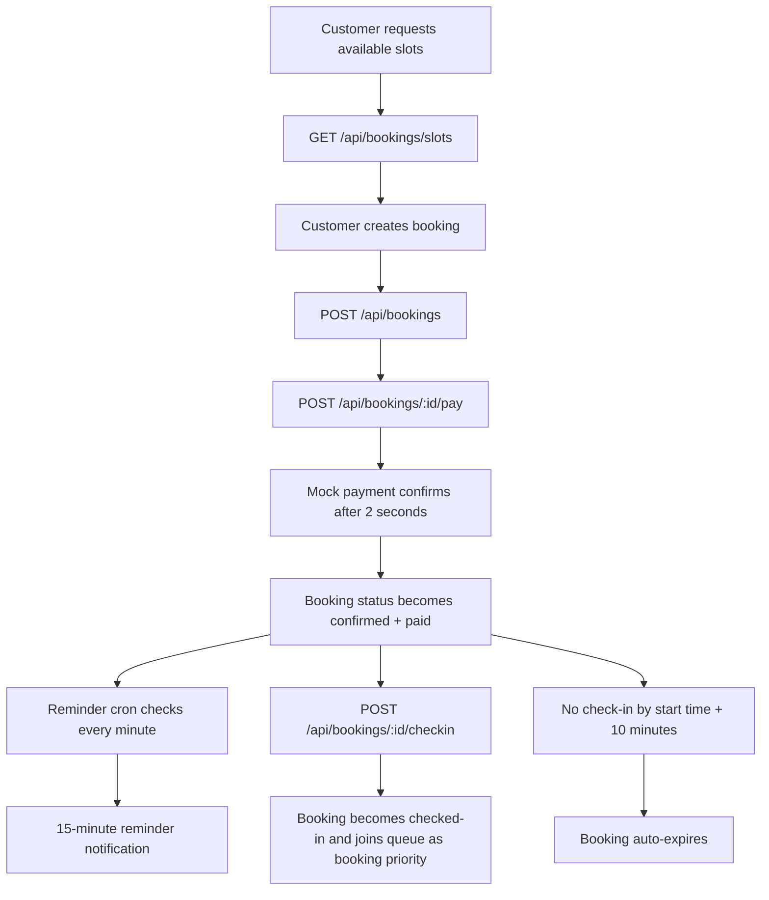

# QBarber Booking Lifecycle

```mermaid
flowchart TD
    A["Customer requests available slots"] --> B["GET /api/bookings/slots"]
    B --> C["Customer creates booking"]
    C --> D["POST /api/bookings"]
    D --> E["POST /api/bookings/:id/pay"]
    E --> F["Mock payment confirms after 2 seconds"]
    F --> G["Booking status becomes confirmed + paid"]
    G --> H["Reminder cron checks every minute"]
    H --> I["15-minute reminder notification"]
    G --> J["POST /api/bookings/:id/checkin"]
    J --> K["Booking becomes checked-in and joins queue as booking priority"]
    G --> L["No check-in by start time + 10 minutes"]
    L --> M["Booking auto-expires"]
```
